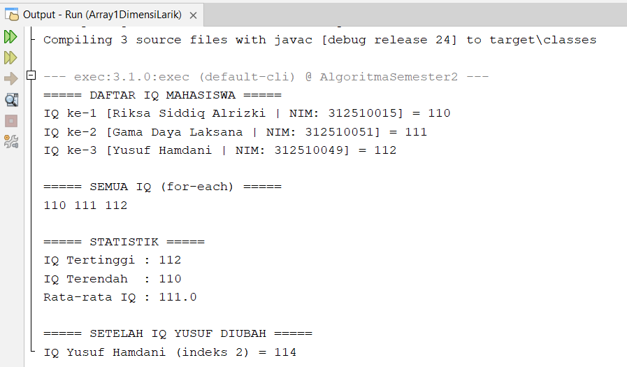

# Array 1 Dimensi - Java

## Anggota Kelompok

| No | Nama | NIM |
|----|------|-----|
| 1  | Riksa Siddiq Alrizki | 312510015 |
| 2  | Gama Daya Laksana | 312510051 |
| 3  | Yusuf Hamdani | 312510049 |

---

## Penjelasan Kode

**1. Simpan data ke array**
```java
int[] iq = {110, 125, 98};
String[] namaSiswa = {"Riksa Siddiq Alrizki", "Gama Daya Laksana", "Yusuf Hamdani"};
String[] nimSiswa = {"312510015", "312510051", "312510049"};
```
Tiga array dibuat untuk nyimpen IQ, nama, dan NIM. Indeks array mulai dari 0.

---

**2. Tampilkan data pakai for biasa**
```java
for (int i = 0; i < iq.length; i++) {
    System.out.println(namaSiswa[i] + " | NIM: " + nimSiswa[i] + " | IQ: " + iq[i]);
}
```
Looping dari indeks 0 sampai habis, cocok kalau butuh nomor indeksnya.

---

**3. Tampilkan pakai for-each**
```java
for (int n : iq) {
    System.out.print(n + " ");
}
```
Lebih simpel dari for biasa, tapi nggak bisa akses indeksnya.

---

**4. Cari nilai tertinggi & terendah**
```java
int tertinggi = iq[0], terendah = iq[0];
for (int i = 1; i < iq.length; i++) {
    if (iq[i] > tertinggi) tertinggi = iq[i];
    if (iq[i] < terendah)  terendah  = iq[i];
}
```
Mulai dari elemen pertama sebagai patokan, lalu bandingkan satu-satu.

---

**5. Hitung rata-rata**
```java
int total = 0;
for (int n : iq) total += n;
double rataRata = (double) total / iq.length;
```
Jumlahkan semua nilai, lalu bagi. `(double)` dipake biar hasilnya ada komanya.

---

**6. Ubah nilai array**
```java
iq[2] = 105;
```
Langsung tunjuk indeksnya, nilai lama langsung ketimpa.

# Project Java Array

Program latihan array 1 dimensi menggunakan Java.

## Hasil Output Program



---

*Tugas mata kuliah Pemrograman Berbasis Objek*
